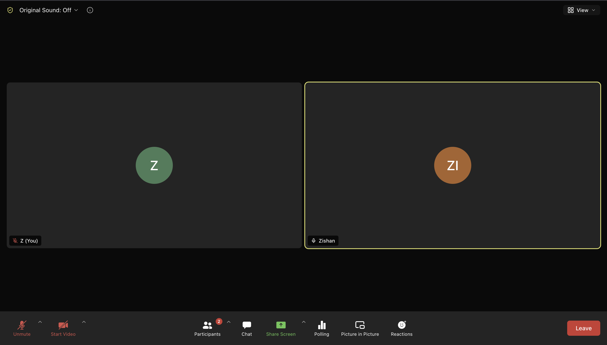

# UNIO MEET - Open-Source Zoom Web Client

A free, open-source **UNIO MEET** built with React, TypeScript, and [VideoSDK](https://dub.sh/X5Fn46e).
It recreates the Zoom web-client experience - real-time HD video and audio, screen share, chat, reactions, polls, cloud recording, and host security controls - with a pixel-accurate UI matched to Figma references.

<div align="center">


[](https://youtu.be/j_biymyP5iw)

<div style="display:flex; margin: auto; justify-content: center; gap: 20px;">
<a href="https://docs.videosdk.live/react/guide/video-and-audio-calling-api-sdk/quick-start" target="_blank"></a>
<a href="https://www.youtube.com/@VideoSDK/videos" target="_blank"></a>
<a href="https://discord.gg/f2WsNDN9S5" target="_blank"></a>
</div>

<br />

[](https://vercel.com/new/clone?repository-url=https%3A%2F%2Fgithub.com%2Fvideosdk-community%2Fzoom-clone&env=VIDEOSDK_API_KEY,VIDEOSDK_SECRET&envDescription=Get%20a%20free%20API%20key%20and%20secret%20from%20the%20VideoSDK%20dashboard.&envLink=https%3A%2F%2Fapp.videosdk.live%2Fapi-keys&project-name=zoom-clone&redirect-url=https%3A%2F%2Fdocs.videosdk.live%2Freact%2Fguide%2Fvideo-and-audio-calling-api-sdk%2Fconcept-and-architecture)

</div>

<br />
<br />

If you are looking for an **open source Zoom** alternative to learn from, self-host, or use as a starting point for your own video conferencing app, this repo is a complete, working reference implementation.

## Why this project

Most "build a UNIO MEET" tutorials stop at two people on a call.
This one goes all the way to the parts that are actually hard: host-authoritative security (real lock, waiting room, and permission enforcement at the media server), late-joiner state sync, cloud recording, and Picture-in-Picture.

- **Real WebRTC video conferencing** over VideoSDK's SFU, not a toy peer-to-peer example.
- **Production-minded architecture** - typed, linted, and covered by federated end-to-end tests.
- **Pixel-accurate Zoom UI** built from Figma references, using the real Zoom control-bar icons.

## Features

### Video and audio

- Real-time HD video and audio over the VideoSDK SFU
- Gallery / grid view with automatic tile sizing
- Active-speaker (Speaker) view with filmstrip
- Gallery / Speaker view switcher
- Screen sharing
- Picture-in-Picture (canvas composite of live videos)
- Cloud recording with a live "Recording" indicator
- Mic / camera toggle with `M` / `V` hotkeys
- Device selection (mic, speaker, camera), applied live
- Pre-join green room with a mirrored camera preview

### Collaboration and engagement

- Chat with persisted history for late joiners
- Chat file sharing - attach up to 2 files per message (10 MB each) via VideoSDK temporary storage
- Floating emoji reactions (clap, thumbs up, heart, laugh, wow, celebrate)
- Raise / lower hand
- Polls - create, launch, vote, live results
- Native VideoSDK collaborative whiteboard

### Host and security controls (host-authoritative)

- Lock meeting - late joiners are removed at the media server
- Waiting room - hold, admit, or deny guests
- Per-permission control: allow / revoke Share, Chat, and self-Unmute
- Mute all participants
- Remove a participant
- End meeting for all vs leave (End-for-all is host-only)

### Pre-meeting and portal

- Home dashboard with a live clock, action tiles, and upcoming meetings
- New / instant meeting
- Join by meeting ID
- Schedule a meeting (topic, time, duration, host-video, mute-on-entry), persisted
- Deep-link into a room as host (`?role=host`), survives reload

## Tech stack

- **React 18** + **TypeScript 5**
- **Vite 6** build tooling
- **Tailwind CSS v4** (Vite plugin, no PostCSS config)
- **Zustand 5** for state
- **react-router-dom 6** for routing
- **@videosdk.live/react-sdk 0.13** for real-time media
- **Playwright** for end-to-end tests
- **pnpm** package manager

## Quick start

```bash
pnpm install
cp .env.example .env
# paste your VideoSDK API key + secret into .env, then:
pnpm dev          # http://localhost:5173
```

Get a free API key and secret from the [VideoSDK dashboard](https://dub.sh/GApkmzs).
That is the whole setup - the build signs the meeting tokens for you (no manual token step).

### Tokens are signed from your key + secret at build time

VideoSDK v2 splits token capabilities by **role**, so the app uses two tokens:

- `VITE_VIDEOSDK_TOKEN` - role `rtc`, used to join and run meetings.
- `VITE_VIDEOSDK_API_TOKEN` - role `crawler`, used to create and validate rooms over REST.

You do not mint these by hand. `vite.config.ts` signs both from `VIDEOSDK_API_KEY` + `VIDEOSDK_SECRET` at build/dev time (`scripts/videosdk-token.mjs`) and injects them into the client.
The **secret is used only in the Node build and is never shipped to the client**.
`pnpm mint-token` still exists but is now optional (the build already does it).

Tokens are baked per build with an expiry (default 7 days, override with `VIDEOSDK_TOKEN_EXPIRY`, e.g. `30d`); a rebuild/redeploy refreshes them.
A pre-set `VITE_VIDEOSDK_TOKEN` (a dashboard token) is used as a fallback when the key/secret are absent.
Never commit `.env`.

### Deploying

Deploy the static build anywhere. Set just two environment variables in your host (Vercel, Netlify, Cloudflare Pages, S3, etc.):

```
VIDEOSDK_API_KEY=your_key
VIDEOSDK_SECRET=your_secret
```

Then build (`pnpm build`) and serve `dist/`. The tokens are signed during the build from those vars - there is no token to paste.

Because this is a single-page app with real path routes (`/meeting/:roomId`), the host must rewrite all unknown paths to `/index.html` so pasted meeting deep-links load instead of 404ing. On Vercel this is handled automatically by the committed `vercel.json`; on other static hosts add the equivalent SPA fallback (Netlify `_redirects`, Cloudflare Pages `_redirects`, etc.).

## How it works

### The meeting

`src/routes/MeetingRoom.tsx` shows a pre-join green room, then joins the meeting.
`LiveMeeting.tsx` is a thin wrapper around VideoSDK's `MeetingProvider`, and `LiveMeetingView.tsx` is the meeting itself - SFU streams, pubsub, host enforcement, recording, Picture-in-Picture, and the waiting room.
The control bar, top bar, panels, tiles, and both view layouts (Gallery and Speaker) are shared across the app.

### Real-time media

VideoSDK provides an SFU (selective forwarding unit), so media does not go peer-to-peer.
The app authenticates with the two tokens described above: the `rtc` token joins meetings, and the `crawler` token creates and validates rooms via REST in `src/lib/videosdk/api.ts`.

### Syncing state with PubSub

VideoSDK is stateless about roles, scheduling, polls, reactions, and security.
All of that is coordinated app-side over VideoSDK PubSub topics.
For anything a late joiner must learn, messages are published with `{ persist: true }` and applied from the returned message history, not only from live callbacks, so a client that subscribes a beat late still catches up.

| Topic | Owner | Payload |
|---|---|---|
| `CHAT` | anyone | chat messages (history for late joiners) |
| `REACTIONS` | anyone | floating emoji |
| `RAISE_HAND` | anyone | raise / lower |
| `HOST_CONTROL` | host | `{ locked, waitingRoomEnabled, permissions }` snapshot |
| `WAITING_SET` | host | ids of held participants (full-state) |
| `BOUNCE` | host to guest | reason shown when a guest is removed |
| `SHARE_CONTROL` | host to presenter | cooperative stop-share |
| `POLL_CREATE` / `POLL_VOTE` | anyone | polls |

### Host-authoritative security

Security is enforced for real, not just by disabling buttons.
The host issues media-server-enforced SDK commands, and the guest UI reacts on top.

- **Lock** removes late joiners in the join handler (muting and darkening them first so nothing leaks), matching Zoom's non-retroactive behavior.
- **Waiting room** broadcasts an authoritative held-participant set that every client honors, force-muting held guests.
- **Unmute permission** source-blocks the guest and force-mutes on revoke, with a per-remote enforcer that re-mutes anyone who unmutes again.
- **Chat and Share permissions** gate the publish path and stop an active remote share cooperatively.

Known ceiling, by design: with no backend, a fully modified client that ignores its own UI could briefly publish before the host re-mutes it.
True bulletproofing would need server-minted VideoSDK role tokens (a token backend), which is out of scope.

### State (Zustand, `src/store/`)

- `useSessionStore` - `role` ("host" or "participant"), not persisted.
- `useUserStore` - display name, persisted.
- `useMeetingsStore` - scheduled meetings, persisted.
- `useSettingsStore` - selected mic / camera / speaker, persisted.
- `useMeetingControlsStore` - lock / waiting room / permissions, not persisted and reset on every meeting mount so controls never leak across meetings.

### Routes

- `/` - Home dashboard.
- `/join` - join by meeting ID.
- `/schedule` - schedule a meeting.
- `/meeting/:roomId` - pre-join, then the meeting.

## Project structure

```
src/
├── App.tsx                 # routes
├── main.tsx                # entry
├── components/
│   ├── home/               # dashboard tiles
│   ├── icons/              # Zoom control-bar SVGs (from Figma)
│   ├── meeting/            # control bar, tiles, meeting view, feature hooks
│   ├── panels/             # participants, chat, polls, reactions
│   └── ui/                 # Avatar, Button
├── lib/
│   ├── polls.ts            # poll helpers
│   └── videosdk/           # token + room REST API
├── routes/                 # Home, Join, Schedule, MeetingRoom
├── store/                  # Zustand stores
├── styles/                 # Tailwind v4 theme tokens
└── test/                   # Playwright specs + helpers
```

Design references live in `docs/figma/`, and the UI is matched against them.

## Scripts

```bash
pnpm dev          # start the dev server on http://localhost:5173
pnpm build        # tsc --noEmit, then vite build
pnpm typecheck    # tsc --noEmit
pnpm lint         # eslint
pnpm test:e2e     # Playwright end-to-end tests
pnpm mint-token   # optional: write pre-signed tokens into .env (the build already signs them)
```

## Testing

- `src/test/two-party.spec.ts` - the real integration suite. It launches Chromium with fake media devices and two federated browser contexts that genuinely meet at the SFU, which is how host enforcement (eject, force-mute, waiting room) is verified.

The tests sign a token the same way the build does (from your key + secret), so they run as long as `.env` has valid credentials.
All live tests self-skip when no token is configured, so the suite stays green without one.

## Keyboard shortcuts

- `M` - toggle mic.
- `V` - toggle video.

Both are ignored while you are typing in an input.

## FAQ

**Is this a real, working UNIO MEET?**
Yes. It runs genuine multi-participant WebRTC video meetings over VideoSDK, with screen share, recording, and host controls enforced at the media server.

**Do I need a VideoSDK account?**
Yes. You need a free VideoSDK key and secret to join meetings. Get them from the [VideoSDK dashboard](https://dub.sh/GApkmzs) and put them in `.env` - the build signs the meeting tokens for you.

**Can I self-host it?**
Yes. It is a static Vite app - set `VIDEOSDK_API_KEY` + `VIDEOSDK_SECRET` as env vars, run `pnpm build`, and serve `dist/` anywhere. No backend or manual token step required.

**Is it free and open source?**
Yes. The code is open source and free to use as a learning resource or a starting point for your own project.

**What can I build on top of it?**
Team video conferencing tools, webinar apps, virtual classrooms, telehealth, or any product that needs a polished meeting UI plus real media and host controls.

**How is it different from real Zoom?**
It clones the web-client UI and meeting mechanics, but there is no backend for accounts, roles, or persistence beyond `localStorage`. Roles are app-local, so security is host-authoritative with the client-trust ceiling noted above.

## Contributing

Issues and pull requests are welcome.
Before opening a PR, please run `pnpm typecheck` and `pnpm lint`, and keep changes aligned with the Figma references in `docs/figma/`.

## License

Released under the [MIT License](LICENSE). Free to use, modify, and distribute.

## Learn More

- [VideoSDK Documentation](https://docs.videosdk.live)
- [VideoSDK React SDK Reference](https://docs.videosdk.live/react/guide/video-and-audio-calling-api-sdk/quick-start)
- [VideoSDK PubSub Guide](https://docs.videosdk.live/react/api/sdk-reference/use-pubsub)

Built with ❤️ using [VideoSDK](videosdk.live)
